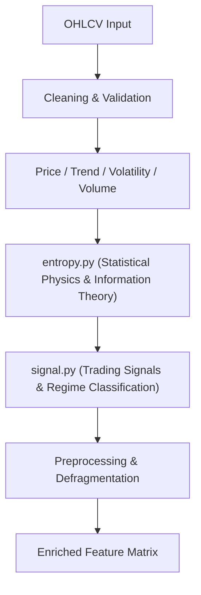

# Implementation Plan - Version 0.4.0: Statistical Physics & Market Complexity Features

## 1. Executive Summary

Version `0.4.0` focuses on introducing **Statistical Physics, Information Theory, and Fractal Dynamics** into the `autofcholv` feature extraction pipeline.

By quantifying market entropy, memory persistence (Hurst Exponent), and geometric complexity (Fractal Dimension), `0.4.0` equips downstream Machine Learning models and quantitative trading systems with deep **Market Regime Detection** capabilities:
- Distinguishing between **Trending / Persistent** ($H > 0.55$), **Mean-Reverting** ($H < 0.45$), and **Random Walk / High-Noise** ($0.45 \le H \le 0.55$) regimes.
- Measuring **Information Uncertainty & Compression** (Shannon & Permutation Entropy) to detect pre-breakout volatility contraction.
- Measuring **Geometric Curve Complexity** (Petrosian, Katz, and Higuchi Fractal Dimensions) to identify turning points and price path roughness.

---

## 2. Architecture & Module Design

### 2.1 New Feature Module: `entropy.py` & `entropy.json`
- **Location**: `src/autofcholv/pipeline/features/entropy.py`
- **Metadata**: `src/autofcholv/pipeline/features/entropy.json`
- **Pipeline Order**: Executed after `price.py` and before `signal.py` in `feature_engineering.py`.



---

## 3. Detailed Feature Catalog

### 3.1 Group A: Hurst Exponent & Long-Memory Dynamics
Measures price return persistence and auto-correlation structure across multi-scale rolling windows.

| Feature Name | Description | Formula / Method | Output Type |
|---|---|---|---|
| `hurst_exponent_t{tier}` | Rolling Hurst exponent over tier windows | Rescaled Range ($R/S$) analysis on log returns | `float64` $[0, 1]$ |
| `hurst_regime_t{tier}` | Categorical market regime flag | `1` if $H > 0.55$, `-1` if $H < 0.45$, `0` otherwise | `int8` $\{-1, 0, 1\}$ |
| `hurst_divergence` | Fast vs slow Hurst divergence | `hurst_exponent_t2 - hurst_exponent_t4` | `float64` |
| `hurst_efficiency_ratio` | Efficiency-adjusted Hurst score | `hurst_exponent * abs(Close - Close_N) / Sum(abs(Change))` | `float64` |

---

### 3.2 Group B: Information Theory & Entropy
Quantifies disorder, randomness, and distribution complexity of returns and volume.

| Feature Name | Description | Formula / Method | Output Type |
|---|---|---|---|
| `shannon_entropy_returns_t{tier}` | Shannon entropy of discretized log returns | $-\sum p_i \log_2(p_i)$ over rolling quantile bins | `float64` $\ge 0$ |
| `shannon_entropy_volume_t{tier}` | Shannon entropy of volume distribution | Binned volume distribution entropy | `float64` $\ge 0$ |
| `permutation_entropy_t{tier}` | Permutation entropy (ordinal pattern structure) | Entropy of relative rank patterns ($m=3, \tau=1$) | `float64` $[0, 1]$ |
| `approx_entropy_close_t{tier}` | Approximate Entropy (ApEn) of price path | Regularity and recurrence statistic | `float64` $\ge 0$ |
| `entropy_compression_ratio` | Ratio of short-term to long-term entropy | `shannon_entropy_returns_t2 / shannon_entropy_returns_t5` | `float64` |

---

### 3.3 Group C: Fractal Dimension & Curve Geometry
Evaluates multi-scale roughness and geometric complexity of the price series.

| Feature Name | Description | Formula / Method | Output Type |
|---|---|---|---|
| `petrosian_fractal_dim_t{tier}` | Petrosian Fractal Dimension (PFD) | $D = \frac{\log_{10} N}{\log_{10} N + \log_{10}(\frac{N}{N + 0.4 N_{\Delta}})}$ (sign changes) | `float64` $[1, 2]$ |
| `katz_fractal_dim_t{tier}` | Katz Fractal Dimension (KFD) | $D = \frac{\log_{10}(L / a)}{\log_{10}(d / a)}$ (path length vs max distance) | `float64` $[1, 2]$ |
| `higuchi_fractal_dim_t{tier}` | Higuchi Fractal Dimension (HFD) | Multi-scale mean curve length slope | `float64` $[1, 2]$ |
| `fractal_efficiency_score` | Hybrid score combining PFD and Katz FD | Normalized composite roughness index | `float64` |

---

### 3.4 Group D: Regime & Signal Integration (`signal.py`)
Trading signals derived from complexity and entropy thresholds:
- `signal_regime_trending_bull`: $H > 0.55 \land \text{Close} > \text{EMA}_{50} \land \text{Entropy} < \text{Threshold}$.
- `signal_regime_trending_bear`: $H > 0.55 \land \text{Close} < \text{EMA}_{50} \land \text{Entropy} < \text{Threshold}$.
- `signal_regime_mean_reverting`: $H < 0.45 \land \text{Entropy} \text{ elevated}$.
- `signal_volatility_compression_breakout`: $\text{entropy\_compression\_ratio} < 0.70 \land \text{BB\_width} \text{ low}$.

---

## 4. Configuration Schema

Extend `src/autofcholv/config/config.py` and `config.default.json` with dynamic lookbacks:

```json
{
  "ENTROPY_WINDOWS": {
    "SHANNON_BINS": 10,
    "PERMUTATION_ORDER": 3,
    "PERMUTATION_DELAY": 1,
    "HIGUCHI_KMAX": 5
  },
  "HURST_THRESHOLDS": {
    "TRENDING": 0.55,
    "MEAN_REVERTING": 0.45
  }
}
```

- All calculation windows map dynamically to configured 5-tier rolling windows (`T1` $\dots$ `T5`).

---

## 5. Performance, Vectorization & Memory Optimization

1. **NumPy Rolling Strides / Sliding Windows**:
   - Compute Shannon and Permutation entropy via vectorized sliding window representations to avoid Python row loops.
2. **Memory Defragmentation Checkpoints**:
   - Insert strategic `df = df.copy()` calls inside `entropy.py` to prevent `PerformanceWarning: DataFrame is highly fragmented`.
3. **Indicator Caching**:
   - Reuse precalculated log returns and price differences from `utils/indicators.py`.

---

## 6. Implementation Steps & Roadmap

```
├── Step 1: Configuration & Defaults Setup
│   ├── Update src/autofcholv/config/config.default.json
│   └── Update src/autofcholv/config/config.py
│
├── Step 2: Implementation of entropy.py & entropy.json
│   ├── Implement Hurst Exponent algorithms (R/S analysis)
│   ├── Implement Shannon & Permutation Entropy calculations
│   ├── Implement Petrosian, Katz, and Higuchi Fractal Dimensions
│   └── Create matching src/autofcholv/pipeline/features/entropy.json
│
├── Step 3: Pipeline Integration
│   ├── Wire entropy.py into src/autofcholv/pipeline/feature_engineering.py
│   └── Wire regime signals into src/autofcholv/pipeline/features/signal.py & signal.json
│
├── Step 4: Unit Testing & Verification
│   ├── Create tests/test_features_entropy.py (fast isolated unit tests)
│   └── Add integration tests in tests/test_core.py
│
└── Step 5: Documentation & Release Artifacts
    ├── Regenerate docs/FEATURES.md (python scripts/generate_feature_md_from_json.py)
    ├── Update docs/STRUCTURE.md
    ├── Regenerate README.md & AGENTS.md
    └── Bump version to 0.4.0 in pyproject.toml & update CHANGELOG.md
```

---

## 7. Acceptance Criteria & Success Metrics

1. **Correctness**:
   - Mathematical outputs for Hurst ($[0, 1]$) and Fractal Dimensions ($[1, 2]$) strictly verified on synthetic geometric Brownian motion and deterministic sine waves.
2. **No Data Leakage**:
   - All rolling calculations use strictly historical windows $[t-W+1, t]$ with zero forward-looking lookahead bias.
3. **Performance**:
   - Execution time for `entropy.py` overhead $\le 10\%$ of total pipeline extraction time.
4. **Test Pass Rate**:
   - $100\%$ pass rate across the full test suite with 0 warnings.
